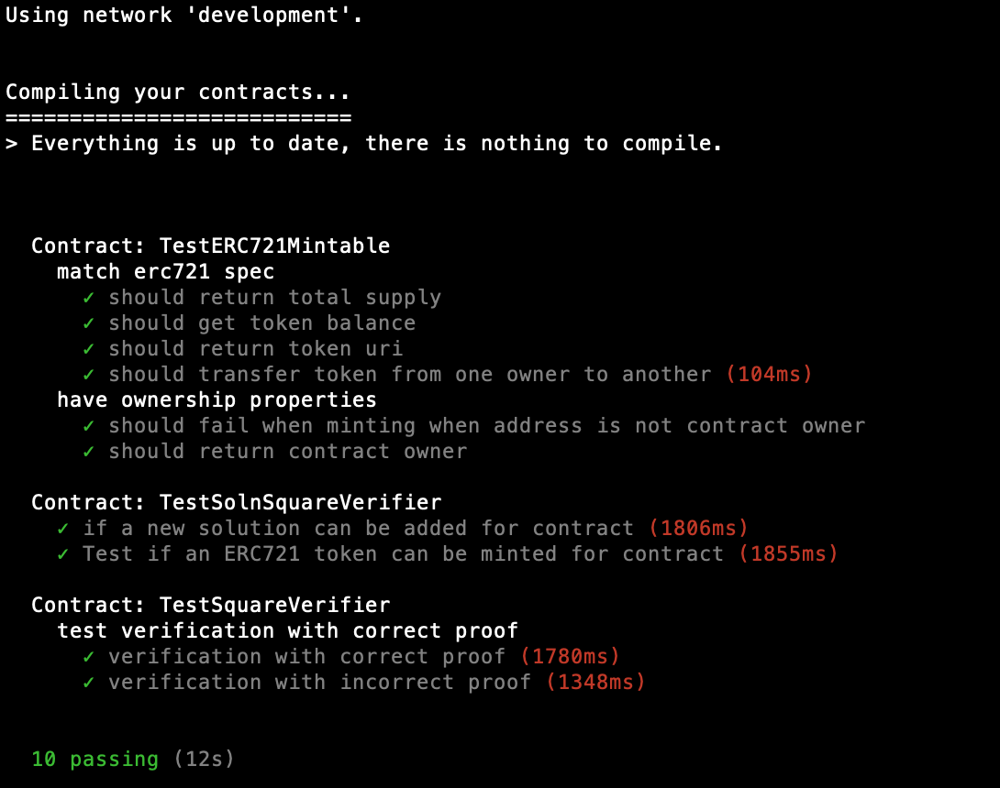

# Capstone-Udacity-BlockChainNanoDegree

This project shows how to use Ethereum, Solidity, Rinkeby Network, ZoKrates and OpenSea to create a mintable verifiable ERC721 Token that uses zkSNARKs to prove someone has a title without revealing anything about the property.


# Frameworks and technologies used
* Ethereum
* Solidity 4
* Ganache CLI
* Truffle
* Mocha JS
* NodeJS
* ZoKrates

# Installation
### Install packages
```
npm install
```

### Compile contracts
```
truffle compile
```

### Migrate contracts
```
truffle migrate
```


### Test contracts
```
truffle test
```



### Rinkeby owner address
```
0x28f2fAe714FDcF85d9FC01Ea837641Ecfbe035EB
```

### Rinkeby contract SolnSquareVerifier address
```
0x8b324b459845203efCE7Af262aBd978E6228e19d
```

### OpenSea asset
https://rinkeby.opensea.io/assets/0x8b324b459845203efce7af262abd978e6228e19d/3

### Contract ABI
Under [eth-contracts/build/contracts](eth-contracts/build/contracts)
